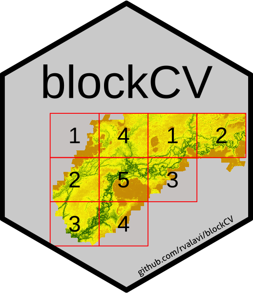

# blockCV 

[](https://travis-ci.org/rvalavi/blockCV)
[](https://ci.appveyor.com/project/rvalavi/blockCV)
[](https://codecov.io/gh/rvalavi/blockCV)
[](https://CRAN.R-project.org/package=blockCV)
[](https://www.rpackages.io/package/blockCV)
[](http://www.gnu.org/licenses/gpl-3.0.html)
[](https://zenodo.org/badge/latestdoi/116337503)


### Spatial and environmental blocking for k-fold cross-validation   
   
In a nutshell, package **blockCV** provides functions to build train and test data sets using three general strategies: *buffers*, *spatial* and *environmental* blocks. It offers several options for how those blocks are constructed and how blocks are allocated to cross-validation folds. It includes a function that applies geostatistical techniques to investigate the existing level of spatial autocorrelation in the chosen predictor variables to inform the choice of the block and buffer size. In addition, visualization tools further aid the selection of block size and provide an understanding of the spread of species data across generated folds. 


## Features
Compared to other available packages, **blockCV** provides more strategies and control over fold generation including:

* There are three blocking methods: **buffers**, **spatial** and **environmental** blocks
* The assignment of the spatial blocks to cross-validation folds can be done in three different ways: **random**, **systematic** and **checkerboard** pattern
* The spatial blocks can be assigned to cross-validation folds to have **evenly distributed records** for **binary** (e.g. species presence-absence/background) or **multi-class** responses (e.g. land cover classes for remote sensing image classification) 
* The position of the spatial blocks can be modified 
* The buffering function can account for *presence-absence* and *presence-background* data types 
* The variables are standardized to avoid wide range variables to dominate the environmental blocks 
* Using geostatistical techniques to inform the choice of a suitable distance band by which to separate the data sets 


## Installation
To install the package from GitHub use:

```r
remotes::install_github("rvalavi/blockCV", dependencies = TRUE)
```
Or installing from CRAN:

```r
install.packages("blockCV", dependencies = TRUE)
```

## Vignette
To see the vignette of the package use:

```r
browseVignettes("blockCV")
```
The vignette is also available via this [link](http://htmlpreview.github.io/?https://github.com/rvalavi/blockCV/blob/master/vignettes/BlockCV_for_SDM.html).


## Basic usage
The following is an example of using spatial block cross-validation for evaluation of species distribution modelling. You can find a comprehensive tutorial in the vignette of the package.

```r
# loading the package
library(blockCV)

# spatial blocking by specified range and random assignment
sb <- spatialBlock(speciesData = pa_data, # sf or SpatialPoints
                   species = "Species", # the response column (binomial or multi-class)
                   rasterLayer = myrasters, # a raster for background (optional)
                   theRange = 70000, # size of the blocks in meters
                   k = 5, # number of folds
                   selection = "random",
                   iteration = 100, # find evenly dispersed folds
                   biomod2Format = TRUE)

```


```r
# investigate spatial autocorrelation in raster covariates
# this helps to choose a suitable size for spatial blocks
spatialAutoRange(rasterLayer = myrasters, # rasterStack file
                 sampleNumber = 5000, # number of cells to be used
                 doParallel = TRUE,
                 showPlots = TRUE)
```


```r
# alternatively, you can manually choose the size of spatial blocks 
rangeExplorer(rasterLayer = myrasters,
              speciesData = pa_data, # response data (optional)
              species = "Species" # the responcse column (optional)
              minRange = 30000, # limit the search domain
              maxRange = 100000)

```


## Citation
To cite package **blockCV** in publications, please use:

Valavi R, Elith J, Lahoz-Monfort JJ, Guillera-Arroita G. **blockCV: An R package for generating spatially or environmentally separated folds for k-fold cross-validation of species distribution models**. *Methods Ecol Evol*. 2019; 10:225–232. [https://doi.org/10.1111/2041-210X.13107](https://doi.org/10.1111/2041-210X.13107)

