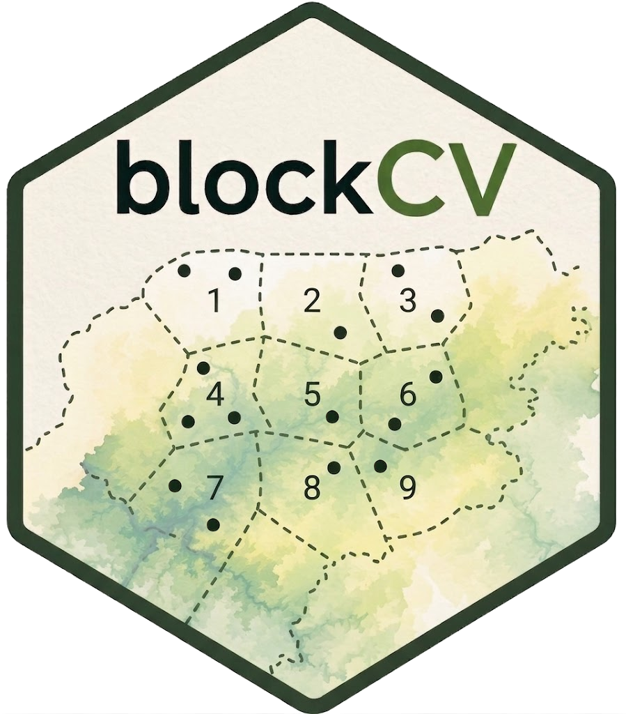

# blockCV 

[](https://github.com/rvalavi/blockCV/actions)
[](https://codecov.io/gh/rvalavi/blockCV)
[](https://CRAN.R-project.org/package=blockCV)
[](https://CRAN.R-project.org/package=blockCV)
[-lightgrey.svg?style=flat)](http://www.gnu.org/licenses/gpl-3.0.html)
[](https://doi.org/10.1111/2041-210X.13107)

### Spatial and environmental blocking for k-fold and LOO cross-validation

The package `blockCV` offers a range of functions for generating train
and test folds for **k-fold** and **leave-one-out (LOO)**
cross-validation (CV). It allows for separation of data spatially and
environmentally, with various options for block construction.
Additionally, it includes a function for assessing the level of spatial
autocorrelation in response or raster covariates, to aid in selecting an
appropriate distance band for data separation. The `blockCV` package is
suitable for the evaluation of a variety of spatial modelling
applications, including classification of remote sensing imagery, soil
mapping, and species distribution modelling (SDM). It also provides
support for different SDM scenarios, including presence-absence and
presence-background species data, rare and common species, and raster
data for predictor variables.
 
## Main features

-   Five cross-validation strategies: spatial blocks (`cv_spatial`),
    clustering (`cv_cluster`), buffering (`cv_buffer`), leave-one-out
    nearest neighbour distance matching (`cv_nndm`), and k-fold nearest
    neighbour distance matching (`cv_knndm`)
-   Spatial blocks can be hexagonal (default), rectangular, or supplied
    as user-defined polygons
-   Spatial blocks can be assigned to folds using random, systematic,
    checkerboard, or predefined selection, with optional balancing for
    records, response classes, quantile bins (`num_bins`), or presences
    in presence-background data
-   Clustering can be based on environmental raster covariates or the
    spatial coordinates of sample points, with optional over-clustering
    and fold balancing
-   Buffering and NNDM support presence-absence,
    presence-background, continuous, count, and multi-class responses
-   kNNDM supports geographical and feature-space matching, prediction
    points supplied with `r`, `pred_points`, or `model_domain`, and block,
    hierarchical, or k-means grouping
-   Spatial autocorrelation ranges can be estimated for binary or
    continuous responses and for continuous raster covariates to guide
    distance-band and block-size choices
-   `cv_plot` visualises folds from all blocking strategies using
    ggplot facets, with combined-fold plotting for k-fold methods
-   Raster processing uses `terra`, with support for `stars`, `raster`,
    and files on disk
-   `cv_distance` and `cv_similarity` evaluate whether folds match the
    prediction domain and where testing folds require extrapolation

## What's new in v4.0

-   Added `cv_knndm`, a k-fold nearest neighbour distance matching
    method with block, hierarchical, and k-means grouping options
-   Added `cv_distance` to assess how well any `blockCV` fold design
    matches the nearest-neighbour distance pattern of the prediction
    domain
-   Made fold balancing explicit with `balance`, including
    presence-background handling and continuous/count response support
    through `num_bins`
-   Improved `cv_similarity` with per-fold extrapolation summaries,
    novelty-rate reporting, and a spatial map view
-   Removed the legacy v2.x function names; use the `cv_*` functions in
    new code

See [NEWS.md](NEWS.md) for the full changelog.

## Installation

To install the latest update of the package from GitHub use:

``` r
remotes::install_github("rvalavi/blockCV", dependencies = TRUE)
```

Or installing from CRAN:

``` r
install.packages("blockCV", dependencies = TRUE)
```

## Vignettes

To see the practical examples of the package see:

1.  [blockCV introduction: how to create block cross-validation
    folds](https://htmlpreview.github.io/?https://github.com/rvalavi/blockCV/blob/master/inst/doc/tutorial_1.html)
2.  [Block cross-validation for species distribution
    modelling](https://htmlpreview.github.io/?https://github.com/rvalavi/blockCV/blob/master/inst/doc/tutorial_2.html)
3.  [Using blockCV with
    `caret`](https://htmlpreview.github.io/?https://github.com/rvalavi/blockCV/blob/master/inst/doc/tutorial_3.html)

## Basic usage

This code snippet showcases some of the package's functionalities, but for more comprehensive tutorials, please refer to the vignette included with the package (and above).

``` r
# loading the package
library(blockCV)
library(sf) # working with spatial vector data
library(terra) # working with spatial raster data
```

``` r
# load raster data; the pipe operator |> is available in R v4.1 or higher
myrasters <- system.file("extdata/au/", package = "blockCV") |>
  list.files(full.names = TRUE) |>
  terra::rast()

# load species presence-absence data and convert to sf
pa_data <- read.csv(system.file("extdata/", "species.csv", package = "blockCV")) |>
  sf::st_as_sf(coords = c("x", "y"), crs = 7845)

```


``` r
# spatial blocking by specified range and random assignment
sb <- cv_spatial(
    x = pa_data, # sf or SpatialPoints of sample data (e.g. species data)
    column = "occ", # optional response column for fold records/balancing
    r = myrasters, # a raster for background (optional)
    size = 450000, # size of the blocks in metres
    k = 5, # number of folds
    hexagon = TRUE, # use hexagonal blocks - default
    selection = "random", # random blocks-to-fold
    iteration = 100, # search for balanced folds
    biomod2 = TRUE # also create folds for biomod2
)
```


Or create spatial clusters for k-fold cross-validation:

``` r
# create spatial clusters
set.seed(6)
sc <- cv_cluster(
    x = pa_data, 
    column = "occ", # optionally count classes/bins in folds
    k = 5
)
```

``` r
# now plot the created folds
cv_plot(
    cv = sc, # a blockCV object
    x = pa_data, # sample points
    r = myrasters[[1]], # optionally add a raster background
    points_alpha = 0.5,
    nrow = 2
)
```


Create k-fold NNDM folds:

``` r
# k-fold nearest neighbour distance matching
knn <- cv_knndm(
    x = pa_data,
    column = "occ", # optionally prefer class-complete folds
    r = myrasters[[1]], # prediction area, or use pred_points/model_domain
    k = 5,
    num_sample = 5000
)
```

``` r
# compare an existing fold design with prediction-domain distances
cv_distance(
    cv = sb,
    x = pa_data,
    r = myrasters[[1]],
    num_sample = 5000
)
```

Investigate spatial autocorrelation in the landscape to choose a
suitable size for spatial blocks:

``` r
# exploring the effective range of spatial autocorrelation in raster covariates or sample data
cv_spatial_autocor(
    r = myrasters, # a SpatRaster object or path to files
    num_sample = 5000, # number of cells to be used
    plot = TRUE
)
```

Alternatively, you can manually choose the size of spatial blocks in an
interactive session using a Shiny app.

``` r
# a shiny interactive app to aid selecting a size for spatial blocks
cv_block_size(
    r = myrasters[[1]],
    x = pa_data, # optionally add sample points
    column = "occ",
    min_size = 2e5,
    max_size = 9e5
)
```

## Reporting issues

Please report issues at: <https://github.com/rvalavi/blockCV/issues>

## Citation

To cite package **blockCV** in publications, please use:

Valavi R, Elith J, Lahoz-Monfort JJ, Guillera-Arroita G. **blockCV: An R
package for generating spatially or environmentally separated folds for
k-fold cross-validation of species distribution models**. *Methods Ecol
Evol*. 2019; 10:225--232. <https://doi.org/10.1111/2041-210X.13107>
