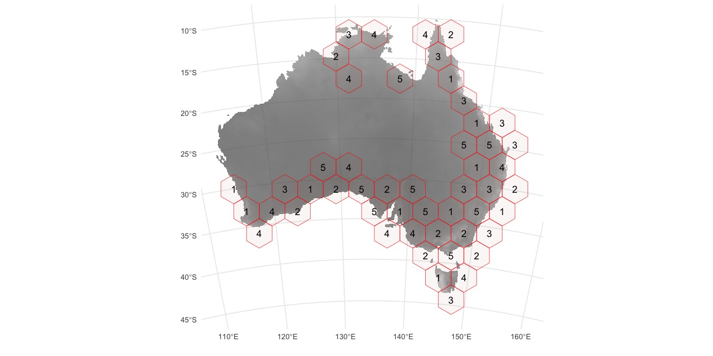
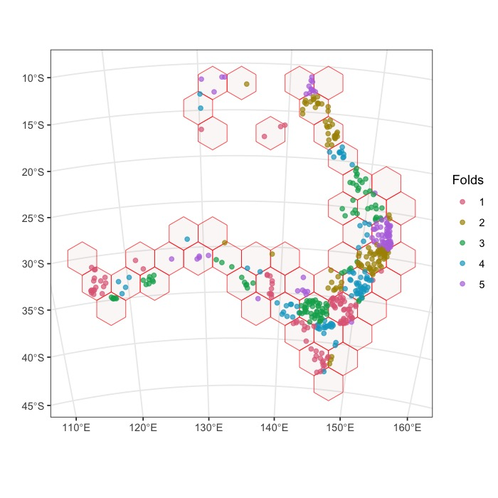
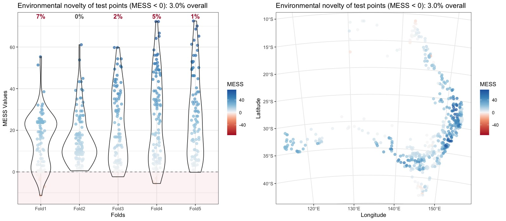
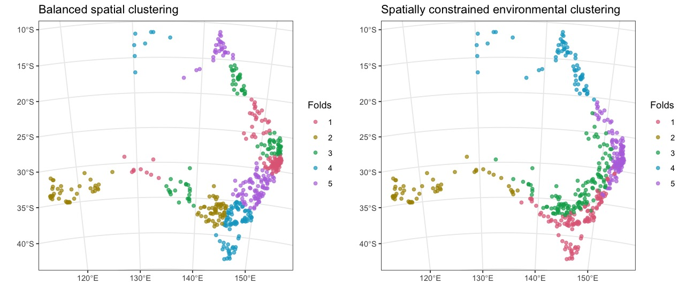

# blockCV 

[](https://github.com/rvalavi/blockCV/actions)
[](https://codecov.io/gh/rvalavi/blockCV)
[](https://github.com/rvalavi/blockCV)
[](https://CRAN.R-project.org/package=blockCV)
[](https://CRAN.R-project.org/package=blockCV)
[-lightgrey.svg?style=flat)](http://www.gnu.org/licenses/gpl-3.0.html)
[](https://doi.org/10.1111/2041-210X.13107)

### Spatially and environmentally separated folds for cross-validation

The `blockCV` package creates spatially or environmentally separated
training and testing folds for **k-fold**, **leave-group-out**, and
**leave-one-out (LOO)** cross-validation. These folds support more
realistic evaluation of models fitted to spatially structured data,
including remote-sensing classification, soil mapping, and species
distribution modelling.

Alongside several fold-construction strategies, `blockCV` provides tools
for checking fold balance, comparing fold separation with the prediction
domain, and identifying environmental extrapolation. It can also estimate
spatial autocorrelation ranges in point data or continuous raster
covariates, providing an initial distance scale to investigate when
designing spatial folds.
 
## Main features

-   Six fold-construction strategies: spatial blocks (`cv_spatial`),
    spatial or environmental clustering (`cv_cluster`), existing grouping
    factors (`cv_group`), buffering (`cv_buffer`), leave-one-out nearest
    neighbour distance matching (`cv_nndm`), and k-fold nearest neighbour
    distance matching (`cv_knndm`)
-   Hexagonal (default), rectangular, or user-defined spatial blocks,
    assigned to folds using random, systematic, checkerboard, or predefined
    selection. Random assignment can search for balanced folds
-   Environmental clustering with optional spatial constraints through
    `spatial_weight`, and optional over-clustering to improve fold balance
-   Geographical or feature-space kNNDM using prediction locations supplied
    by a raster (`r`), prediction points (`pred_points`), or a polygon
    (`model_domain`), with block, hierarchical, or k-means grouping
-   Response-aware fold summaries and, where supported, balancing for
    binary, multi-class, continuous, count, and presence-background data.
    Continuous and count responses can be grouped into quantile bins using
    `num_bins`
-   Fold diagnostics through `cv_summary`, `cv_distance`, and
    `cv_similarity` to assess balance, train-test separation, agreement
    with prediction-domain distances, and environmental extrapolation
-   Fold visualisation with `cv_plot`, including faceted train-test maps
    for every strategy and combined-fold maps for k-fold methods
-   Spatial autocorrelation and interactive block-size tools
    (`cv_spatial_autocor` and `cv_block_size`) for exploring an initial
    separation distance
-   Raster processing with `terra`, including support for `stars`,
    `raster`, and raster files on disk

## What's new in v4.0

-   Added `cv_knndm` for k-fold nearest neighbour distance matching, with
    geographical and feature-space matching and block, hierarchical, or
    k-means grouping
-   Added `cv_group` for leave-group-out cross-validation based on an
    existing site, plot, campaign, individual, or other grouping factor
-   Added `cv_summary` for one-call fold-quality summaries and warnings,
    and `cv_distance` for comparing fold separation with nearest-neighbour
    distances in the prediction domain
-   Expanded `cv_similarity` with per-fold extrapolation summaries,
    overall novelty rates, and spatial map visualisation
-   Made fold balancing explicit in `cv_spatial`, `cv_cluster`, and
    `cv_knndm`; added presence-background balancing and quantile binning
    (`num_bins`) for continuous or count responses
-   Added spatially constrained environmental clustering through
    `cv_cluster(spatial_weight = ...)`
-   Added combined-fold maps to `cv_plot` and informative print methods
    for fold and diagnostic objects
-   Expanded `cv_nndm` and `cv_knndm` to accept prediction rasters,
    prediction points, or model-domain polygons
-   Removed the legacy v2.x function names. Other breaking changes include
    the new structured return value from `cv_similarity`, the rename of
    `num_plot` to `num_plots`, and interactive-only defaults for several
    automatic plots, reports, and progress bars

See [NEWS.md](NEWS.md) for the full changelog.

## Installation

To install the latest update of the package from GitHub use:

``` r
remotes::install_github("rvalavi/blockCV", build_vignettes = TRUE, dependencies = TRUE)
```

Or installing from CRAN:

``` r
install.packages("blockCV", dependencies = TRUE)
```

## Vignettes

The package ships with several tutorials as vignettes:

1.  blockCV introduction: how to create block cross-validation folds (`tutorial_1`)
2.  Choosing and diagnosing spatial folds (`tutorial_2`)
3.  Block cross-validation for species distribution modelling (`tutorial_3`)
4.  Using blockCV with `caret` (`tutorial_4`)

To read them, install the package with the vignettes built (see [Installation](#installation) and use `build_vignettes = TRUE`), then open them from R:

``` r
# list all tutorials
browseVignettes("blockCV")

# or open one directly
vignette("tutorial_1", package = "blockCV")
```

## Basic usage

The examples below highlight a few common workflows. See the
[vignettes](#vignettes) for more information and complete examples.

``` r
# loading the package
library(blockCV)
library(sf) # working with spatial vector data
library(terra) # working with spatial raster data
```

``` r
# load raster data; the pipe operator |> is available in R v4.1 or higher
covars <- system.file("extdata/au/", package = "blockCV") |>
  list.files(full.names = TRUE) |>
  terra::rast()

# load species presence-absence data and convert to sf
pa_data <- read.csv(system.file("extdata/", "species.csv", package = "blockCV")) |>
  sf::st_as_sf(coords = c("x", "y"), crs = 7845)
```


``` r
# spatial blocking by specified range and random assignment
sb <- cv_spatial(
    x = pa_data,          # sf or SpatialPoints of sample data (e.g. species data)
    column = "occ",       # optional response column for fold records/balancing
    r = covars,           # a raster for background (optional)
    size = 350000,        # size of the blocks in metres
    k = 5,                # number of folds
    hexagon = TRUE,       # use hexagonal blocks - default
    selection = "random", # random blocks-to-fold
    balance = TRUE,       # find balanced folds
    iteration = 100,      # search for balanced folds
    biomod2 = TRUE        # also create folds for biomod2
)
```


Use `cv_plot()` or the generic `plot()` method to visualise the folds.

```r
plot(sb, pa_data, combine_folds = TRUE)
```


`cv_similarity()` compares each testing fold with its corresponding training
data to identify environmental extrapolation. Negative MESS values flag test
points outside the environmental range represented by their training data.
The distribution and map views show how much extrapolation occurs and where,
while the returned object also provides per-fold and overall summaries.

``` r
sim1 <- cv_similarity(cv = sb, x = pa_data, r = covars, method = "MESS")
sim2 <- cv_similarity(cv = sb, x = pa_data, r = covars, method = "MESS", type = "map")

sim_map <- sim2$plot +
    ggplot2::labs(x = "Longitude", y = "Latitude")

cowplot::plot_grid(sim1$plot, sim_map, nrow = 1)
```



`cv_cluster()` can be tailored to different validation goals. For spatial
clustering, `balance = TRUE` forms additional candidate clusters and assigns
them to folds to improve record or response-class balance; `k_multiplier`
controls the trade-off with geographical compactness. For environmental
clustering, `spatial_weight` adds a soft geographical constraint so
environmentally similar folds are less spatially scattered.

``` r
# balanced spatial clustering
set.seed(6)
bc <- cv_cluster(
    x = pa_data,
    column = "occ",
    k = 5,
    balance = TRUE,
    k_multiplier = 3
)

# spatially constrained environmental clustering
set.seed(6)
sec <- cv_cluster(
    x = pa_data,
    r = covars,
    column = "occ",
    k = 5,
    spatial_weight = 0.4
)
```

``` r
bc_plot <- cv_plot(bc, x = pa_data, combine_folds = TRUE) +
    ggplot2::labs(title = "Balanced spatial clustering")

sec_plot <- cv_plot(sec, x = pa_data, combine_folds = TRUE) +
    ggplot2::labs(title = "Spatially constrained environmental clustering")

cowplot::plot_grid(bc_plot, sec_plot, nrow = 1)
```



Create k-fold NNDM folds:

``` r
# k-fold nearest neighbour distance matching
knn <- cv_knndm(
    x = pa_data,
    column = "occ", # optionally prefer class-complete folds
    r = covars, # prediction area, or use pred_points/model_domain
    k = 5,
    num_sample = 5000
)
```

``` r
# compare an existing fold design with prediction-domain distances
cv_distance(
    cv = sb,
    x = pa_data,
    r = covars,
    num_sample = 5000
)
```

Investigate spatial autocorrelation in the landscape to choose a
suitable size for spatial blocks:

``` r
# exploring the effective range of spatial autocorrelation in raster covariates or sample data
cv_spatial_autocor(
    r = covars, # a SpatRaster object or path to files
    num_sample = 5000, # number of cells to be used
    plot = TRUE
)
```

For the residual-based block-size guidance in Roberts et al. (2017), fit
the model first, add its residuals to the sample points, and pass that
residual column to `cv_spatial_autocor(x = ..., column = ...)`. Ranges
estimated from the raw response or raster covariates are exploratory
proxies and may mis-size blocks for residual autocorrelation.

Alternatively, you can manually choose the size of spatial blocks in an
interactive session using a Shiny app.

``` r
# a shiny interactive app to aid selecting a size for spatial blocks
cv_block_size(
    r = covars[[1]],
    x = pa_data, # optionally add sample points
    column = "occ",
    min_size = 2e5,
    max_size = 9e5
)
```

## Reporting issues

Please report issues at: <https://github.com/rvalavi/blockCV/issues>

## Citation

To cite package **blockCV** in publications, please use:

Valavi R, Elith J, Lahoz-Monfort JJ, Guillera-Arroita G. **blockCV: An R
package for generating spatially or environmentally separated folds for
k-fold cross-validation of species distribution models**. *Methods Ecol
Evol*. 2019; 10:225--232. <https://doi.org/10.1111/2041-210X.13107>
