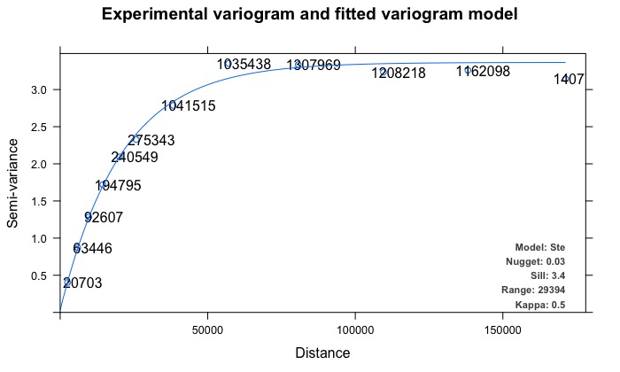

```{r setup, include = FALSE}
knitr::opts_chunk$set(echo = TRUE, tidy = TRUE, tidy.opts = list(width.cutoff = 80), fig.align="center", message = FALSE, warning = FALSE)
```

## Introduction

Simple random selection of training and testing folds in the structured environment leads to an underestimation of error in the evaluation of spatial predictions and may result in inappropriate model selection (Telford and Birks, 2009; Roberts et al., 2017). The use of spatial and environmental blocks to separate training and testing sets has been suggested as a good strategy for realistic error estimation in datasets with dependence structures, and more generally as a robust method for estimating the predictive performance of models used to predict mapped distributions (Roberts et al., 2017). Package `blockCV` provides functions to separate train and test sets using *buffers*, *spatial* and *environmental* blocks. It provides several options for how those blocks are constructed. It also has a function that applies geostatistical techniques to investigate the existing level of spatial autocorrelation in the covariates to inform the choice of a suitable  distance band by which to separate the data sets. In addition, some visualization tools are provided to help the user choose the block size and explore generated folds. The package has been written with **Species Distribution Modelling (SDM)** in mind, and the functions allow for a number of common scenarios (including presence-absence and presence-background species data, rare and common species, raster data for predictor variables). Although it can be applied to any spatial modelling e.g. multi-class responses for remote sensing image classification.
   
You can find more information about blocking strategies of **blockCV** package and in general block cross-validation technique in the package associated paper [here](https://doi.org/10.1111/2041-210X.13107).
   
This document presents the main functions of the package and illustrates its usage with three examples: modelling using **randomForest**, **maxnet** (new implementation of Maxent software in R) and  **biomod2** packages.

## Installation

The **`blockCV`** is available in CRAN and the latest update can also be downloaded from GitHub. It is recommended to install the dependencies of the package. To install the package use:

```{r, eval=FALSE}
# install stable version from CRAN
install.packages("blockCV", dependencies = TRUE)

# install latest update from GitHub
remotes::install_github("rvalavi/blockCV", dependencies = TRUE)

```

```{r, results="hide", warning=FALSE, message=FALSE}
# loading the package
library(blockCV)

```

## Package data
The package contains the raw format of the following data:

- Raster covariates of Australian Wet Tropic region (`.tif`)
- Simulated species data (`.csv`)

These data are used to illustrate how the package is used. The raster data include several bioclimatic and topographic variables from Australian Wet Tropic region aggregated to 800 m resolution. The species data contains records of a species, simulated based on the above environmental variables for the region. There are two `.csv` files with presence-absence and presence-background data.

To load the package raster data use:
```{r, fig.height=5, fig.width=7.2, warning=FALSE, message=FALSE}
library(ggplot2) # plotting
library(rasterVis) # plotting raster data
library(sf) # working with spatial vector data
library(terra) # working with saptial raster data
library(tmap) # plotting spatial data

# load raster data
rasters <- system.file("extdata/au/", package = "blockCV") |>
  list.files(full.names = TRUE) |>
  terra::rast()

```

The presence absence species data include 400 presence points and 500 absence points. The appropriate format of species data for the `blockCV` package is simple features (`sf`). We convert the `data.frame` to `sf` as follows:

```{r, fig.height=4.5, fig.width=7.1}
# load species presence-asence data and convert to sf
points <- read.csv(system.file("extdata/", "species.csv", package = "blockCV"))
head(points)

```


```{r, fig.height=4.5, fig.width=7.1}
pa_data <- sf::st_as_sf(points, coords = c("x", "y"), crs = 7845)
```


```{r, fig.height=4.5, fig.width=7.1}
tm_shape(rasters[[1]]) +
  tm_raster(legend.show = FALSE, n = 30, palette = gray.colors(10)) +
  tm_shape(pa_data) +
  tm_dots(col = "occ", style = "cat", size = 0.1)

```


```{r, fig.height=4.5, fig.width=7.1}
# plot species data on the map
rasterVis::gplot(rasters[[1]]) +
  geom_tile(aes(fill = value)) +
  scale_fill_distiller(palette = 4, na.value = NA) +
  guides(fill = "none") +
  geom_sf(data = pa_data, 
          aes(color = as.factor(occ)),
          inherit.aes = FALSE) +
  scale_color_manual(values = c("red", "yellow")) +
  theme_minimal()

```
   

## Blocking strategies
### Spatial block
The function `spatialBlock` creates spatially separated folds based on a pre-specified distance (cell size of the blocks). It then assigns blocks to the training and testing folds with *random*, *checkerboard pattern* or in a *systematic* manner. Another blocking strategy provided by this function is to divide the study area into vertical or horizontal bins of a given number of rows/colmuns, as used by Bahn & McGill (2013) and Wenger & Olden (2012) respectively.
   
To keep the consistency with other functions, the distance (`theRange`) should be in **metres**, regardless of the unit of the reference system of the input data. When the input map has *geographic coordinate system* (decimal degrees), the block size is calculated based on dividing `theRange` by **111325** (the standard distance of a degree in metres, on the Equator) to change metre to degree. This value can be changed by the user via the `degMetre` argument.
   
The `xOffset` and `yOffset` can be used to shift the spatial position of the blocks in horizontal and vertical axes, respectively. This only works when the block have been built based on `theRange`. The `blocks` argument allows users to define an external spatial polygon as blocking layer. The polygon layer must cover all the species points. In addition, blocks can be masked by species spatial data. This option keeps the blocks that cover species data and remove the rest.
   
```{r, results='hide', fig.keep='all', warning=FALSE, message=FALSE, fig.height=5, fig.width=7}
# spatial blocking by specified range with random assignment
sb <- cv_spatial(x = pa_data,
                 column = "occ",
                 k = 5,
                 size = 350000,
                 selection = "random",
                 iteration = 50)

```


```{r warning=FALSE, message=FALSE, fig.height=5, fig.width=7}
sb2 <- cv_spatial(x = pa_data,
                 column = "occ",
                 k = 5,
                 size = 350000,
                 hexagon = FALSE,
                 selection = "random",
                 iteration = 50,
                 progress = FALSE)
```

The assignment of folds to each block can also be done in a systematic manner using `selection = "systematic"` argument. 

```{r warning=FALSE, message=FALSE, fig.height=5, fig.width=7}
# spatial blocking by rows with systematic assignment
sb3 <- cv_spatial(x = pa_data,
                 column = "occ",
                 k = 5,
                 size = 350000,
                 hexagon = FALSE,
                 selection = "checkerboard",
                 iteration = 50)

```

For visualising the species data on top of the spatial blocks, one can use `geom_sf` function of the `ggplot2` package. However, a more sophisticated way of plotting each fold separately is presented in the *visualisation tools* section.

```{r warning=FALSE, message=FALSE, fig.height=5, fig.width=7}
tm_shape(sb3$blocks) +
  tm_fill(col = "folds", style = "cat")

```
 
### Buffering

The function `buffering` generates spatially separated training and testing folds by considering buffers of specified distance around each observation point. This approach is a form of *leave-one-out* cross-validation. Each fold is generated by excluding nearby observations around each testing point within the specified distance (ideally the range of spatial autocorrelation). In this method the test set never directly abuts a training presence or absence.
  
When working with **presence-background** (presence and pseudo-absence) data (specified by `spDataType` argument), only presence records are used for specifying the folds. Consider a target presence point. The buffer is defined around this target point, using the specified range (`theRange`). The testing fold comprises the target presence point and all background points within the buffer. Any non-target presence points inside the buffer are excluded. All points (presence and background) outside of buffer are used for training set. The method cycles through all the presence data, so the number of folds is equal to the number of presence points in the dataset.

For **presence-absence** data, folds are created based on all records, both presences and absences. As above, a target observation (presence or absence) forms a test point, all presence and absence points other than the target point within the buffer are ignored, and the training set comprises all presences and absences outside the buffer. Apart from the folds, the number of *training-presence*, *training-absence*, *testing-presence* and *testing-absence* records is stored and returned in the `records` table. If `species = NULL` (no column with 0s and 1s is defined), the procedure is like presence-absence data. All other types of data (continuous, count or multi-class response) should be used like this.


In the following `buffering` example, presence-background data are used. As explained above, by default the background data within any target point will remain in the testing fold. This can be changed by setting `addBG = FALSE` (this option only works when `spDataType = "PB"`; note the default value is `"PA"`).

```{r eval=FALSE}
# buffering with presence-background data
bf2 <- cv_buffer(x = pa_data, 
                 column = "occ",
                 size = 350000)

```


### Environmental block

The function `envBlock` uses *clustering* methods to specify sets of similar environmental conditions based on the input covariates. Species data corresponding to any of these groups or clusters are assigned to a fold.

As *k-means* algorithms use Euclidean distance to estimate clusters, the input covariates should be quantitative variables. Since variables with wider ranges of values might dominate the clusters and bias the environmental clustering (Hastie et al., 2009), all the input rasters are first standardized within the function. This is done either by normalizing based on subtracting the mean and dividing by the standard deviation of each raster (the default) or optionally by standardizing using linear scaling to constrain all raster values between `0` and `1`. By default, the clustering is done in the raster space. In this approach, the clusters will be consistent throughout the region and across species (in the same region). However, this may result in cluster(s) that cover none of the species records especially when species data is not dispersed throughout the region or the number of clusters (`k` or folds) is high. In this case, the number of folds is less than the specified `k`. If `rasterBlock = FALSE`, the clustering will be done based only on the values of the predictors at the species presence and absence/background points. In this case, and the number of the folds will be the same as `k`.

Note that the input raster layer should cover all the species points, otherwise an error will rise. The records with no raster value should be deleted prior to the analysis.

```{r eval=FALSE, warning=FALSE, message=FALSE}
# environmental clustering
eb <- cv_cluster(x = pa_data,
                 column = "occ",
                 r = rasters,
                 k = k, 
                 scale = TRUE, 
                 num_sample = 500) # here number is low for test
```


## Visualising the folds


```{r warning=FALSE, message=FALSE, fig.height=5, fig.width=7}
cv_plot(cv = sb3,
        x = pa_data, 
        r = rasters) # optionally add a raster background

```


## Estimating size: the effective range of spatial autocorrelation
To support a first choice of block size, prior to any model fitting, package `blockCV` includes the option for the user to look at the existing autocorrelation in the predictors, as an indication of landscape spatial structure in their study area. The tool does not suggest any absolute solution to the problem, but serves as a guide to the user. The function works by automatically fitting variograms to each continuous raster and finding the effective range of spatial autocorrelation. Variogram is a fundamental geostatistical tool for measuring spatial autocorrelation. It does so by assessing variability between all pairs of points (O’Sullivan and Unwin, 2010). It provides information about *the effective range of spatial autocorrelation* which is the range over which observations are independent.

  
```{r, results='hide', fig.keep='all', warning=FALSE, message=FALSE, fig.height=5, fig.width=7.2}
sac2 <- cv_spatial_autocor(r = rasters, 
                           num_sample = 5000)

```

The plotted block size is based on the *median* of the spatial autocorrelation ranges. This could be as the **minimum block size** for creating spatially separated folds. Variograms are computed taking a number of random points (`5000` as default) from each input raster file, using parallel processing to speed up the computation (optional). The variogram fitting procedure is done using [**automap**](https://CRAN.R-project.org/package=automap) package (Hiemstra et al., 2009), using the isotropic variogram and assuming the data meets the geostatistical criteria e.g. stationarity.

The output object of this function is an `SpatialAutoRange` object, an object of class S3.

```{r}
# class of the output result
class(sac2)
```
   
To see the details of the fitted variograms:

```{r}
# summary statistics of the output
summary(sac2)
```


```{r, warning=FALSE, message=FALSE, fig.height=5, fig.width=7.2}
sac <- cv_spatial_autocor(x = pa_data, 
                          column =  "occ")

```

To visualise them (this needs the automap package to be loaded): 

```{r, eval=TRUE, fig.height=4, fig.width=7}
library(automap)

plot(sac$variograms[[1]])

```
<!--  -->
   

Package `blockCV` provides two major visualisation tools for graphical exploration of the generated folds and assisting in block size selection. These tools have been developed as local web applications using R-package `shiny`. With `rangeExplorer`, the user can choose among block sizes in a specified range, visualise the resulting blocks interactively, viewing the impact of block size on number and arrangement of blocks in the landscape (and optionally on the distribution of species data in those blocks). The `foldExplorer` tool displays folds and the number of records in each fold; it works for all three blocking methods.


```{r, eval=FALSE}
# explore the block size
rangeExplorer(rasterLayer = awt) # the only mandatory input

# add species data to add them on the map
rangeExplorer(rasterLayer = awt,
              speciesData = pa_data,
              species = "Species",
              rangeTable = NULL,
              minRange = 30000, # limit the search domain
              maxRange = 100000)
```

Note that the interactive plots cannot be shown here, as they require opening an external window or web browser. When using `rangeExplorer`, slide to the selected block size, and click **Apply Changes** to change the block size.


## References:
- Bahn, V., & McGill, B. J. (2012). Testing the predictive performance of distribution models. Oikos, 122(3), 321–331.
   
- Hiemstra, P. H., Pebesma, E. J., Twenhöfel, C. J., & Heuvelink, G. B. (2009). Real-time automatic interpolation of ambient gamma dose rates from the Dutch radioactivity monitoring network. Computers & Geosciences, 35(8), 1711–1721.

- Hastie, T., Tibshirani, R., & Friedman, J. (2009). The elements of statistical learning: Data Mining, Inference, and Prediction (2nd ed., Vol. 1). Springer series in statistics New York.
   
- O’Sullivan, D., & Unwin, D. J. (2010). Geographic Information Analysis (2nd ed.). John Wiley & Sons.

- Phillips, S. J., Anderson, R. P., Dudík, M., Schapire, R. E., & Blair, M. E. (2017). Opening the black box: an open-source release of Maxent. Ecography.
   
- Roberts, D.R., Bahn, V., Ciuti, S., Boyce, M.S., Elith, J., Guillera-Arroita, G., Hauenstein, S., Lahoz-Monfort, J.J., Schröder, B., Thuiller, W., others, 2017. Cross-validation strategies for data with temporal, spatial, hierarchical, or phylogenetic structure. Ecography. 40: 913-929.
   
- Telford, R. J., & Birks, H. J. B. (2009). Evaluation of transfer functions in spatially structured environments. Quaternary Science Reviews, 28(13), 1309–1316.

- Thuiller, W., Georges, D., Engler, R., & Breiner, F. (2017). biomod2: Ensemble Platform for Species Distribution Modeling. R package version 3.3-7. https://CRAN.R-project.org/package=biomod2.

- Valavi R, Elith J, Lahoz-Monfort JJ, Guillera-Arroita G. **blockCV: An R package for generating spatially or environmentally separated folds for k-fold cross-validation of species distribution models**. *Methods Ecol Evol.* 2019; 10:225–232. [doi: 10.1111/2041-210X.13107](https://doi.org/10.1111/2041-210X.13107)

