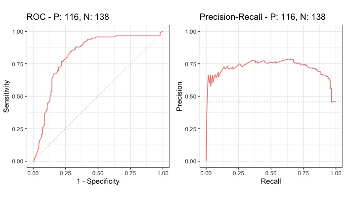

## Introduction

Species distribution models (SDMs) are widely used tools for predicting the potential distribution of a species based on environmental variables. However, it is crucial to evaluate the performance of these models to ensure their accuracy and reliability. One commonly used method for evaluating the performance of SDMs is **block cross-validation** (read more in *Valavi et al. 2019* and the Tutorial 1). This approach allows for a more robust evaluation of the model as it accounts for spatial autocorrelation and other spatial dependencies (Roberts et al. 2017). This document illustrates how to utilize the `blockCV` package to evaluate the performance of SDMs using block cross-validation.

Two examples are provided: modelling using the `randomForest`, and `biomod2` packages.

Check new updates of `blockCV` in the tutorial 1- blockCV introduction: how to create block cross-validation folds.

Please cite `blockCV` by: *Valavi R, Elith J, Lahoz-Monfort JJ, Guillera-Arroita G. blockCV: An R package for generating spatially or environmentally separated folds for k-fold cross-validation of species distribution models. Methods Ecol Evol. 2019; 10:225–232.* [doi: 10.1111/2041-210X.13107](https://doi.org/10.1111/2041-210X.13107)

## Reading and plotting data
The `blockCV` package contains the raw format of the following data:

- Raster covariates of Australia (`.tif`)
- Simulated species data (`.csv`)

These data are used to illustrate how the package is used. The raster data include several bioclimatic variables for Australia. The species data include presence-absence records (binary) of a simulated species.

```{r echo=FALSE}
options(scipen = 10)
```


To load the package raster data use:

```{r, fig.height=5, fig.width=7.2, warning=FALSE, message=FALSE}
library(sf) # working with spatial vector data
library(terra) # working with spatial raster data
library(tmap) # plotting maps

# load raster data
# the pipe operator |> is available for R version 4.1 or higher
rasters <- system.file("extdata/au/", package = "blockCV") |>
  list.files(full.names = TRUE) |>
  terra::rast()

```

The presence-absence species data include `243` presence points and `257` absence points.

```{r, fig.height=4.5, fig.width=7.1}
# load species presence-asence data and convert to sf
points <- read.csv(system.file("extdata/", "species.csv", package = "blockCV"))
head(points)

```

The appropriate format of species data for the `blockCV` package is simple features (from the `sf` package). The data is provide in [GDA2020 / GA LCC](https://epsg.io/7845) coordinate reference system with `"EPSG:7845"` as defined by `crs = 7845`. We convert the `data.frame` to `sf` as follows:

```{r, fig.height=4.5, fig.width=7.1}
pa_data <- sf::st_as_sf(points, coords = c("x", "y"), crs = 7845)
```

Let's plot the species data using [`tmap`](https://cran.r-project.org/package=tmap)  package:

```{r, fig.height=4.5, fig.width=7.1}
tm_shape(rasters[[1]]) +
  tm_raster(legend.show = FALSE, n = 30, palette = gray.colors(10)) +
  tm_shape(pa_data) +
  tm_dots(col = "occ", style = "cat", size = 0.1)

```

# Generating block CV folds

Here, we generate two CV strategies, one k-fold CV using `cv_spatial` and one LOO CV using `cv_nndm`. See more options and configurations in the *Tutorial 1 - introduction to `blockCV`*.

```{r message=TRUE, warning=TRUE}
library(blockCV)

```


Creating spatial blocks: 

```{r, fig.keep='all', warning=FALSE, message=FALSE, fig.height=5, fig.width=7}
scv1 <- cv_spatial(
  x = pa_data,
  column = "occ", # the response column (binary or multi-class)
  r = rasters,
  k = 5, # number of folds
  size = 360000, # size of the blocks in metres
  selection = "random", # random blocks-to-fold
  iteration = 50, # find evenly dispersed folds
  progress = FALSE, # turn off progress bar
  biomod2 = TRUE, # also create folds for biomod2
  raster_colors = terrain.colors(10, rev = TRUE) # options from cv_plot for a better colour contrast
) 

```


Now, let's create LOO CV folds with nearest neighbour distance matching (NNDM; Milà et al. 2022) algorithm. To run `cv_nndm`, you need a measure of spatial autocorrelation present in your data. This can be done wither by 1) fitting a model and use it's residual to calculate spatial autocorrelation, or 2) use the autocorrelation of response variable for it (Milà et al, 2022; Roberts et al. 2017). Here, we calculate spatial autocorrelation range in the response using the `cv_spatial_autocor` function.

```{r}
range <- cv_spatial_autocor(
  x = pa_data, # species data
  column = "occ", # column storing presence-absence records (0s and 1s)
  plot = FALSE
)

range$range
```

So the range of spatial autocorrelation is roughly `360` kilometres.

```{r fig.height=5, fig.width=7}
scv2 <- cv_nndm(
  x = pa_data,
  column = "occ",
  r = rasters,
  size = 360000, # range of spatial autocorrelation
  num_sample = 10000, # number of samples of prediction points
  sampling = "regular", # sampling methods; it can be random as well
  min_train = 0.1, # minimum portion to keep in each train fold
  plot = TRUE
)
```

You can visualise the generated folds of both methods using `cv_plot` function. Here is three folds from the `cv_nndm` object:

```{r}
# see the number of folds in scv2 object
scv2$k

```


```{r fig.height=5, fig.width=8}
cv_plot(
  cv = scv2, # cv object
  x = pa_data, # species spatial data
  num_plots = c(1, 10, 100) # three of folds to plot
)
```


## Evaluating SDMs with block cross-validation: examples

In this section, we show how to use the folds generated by `blockCV` in the previous sections for the evaluation of SDMs constructed on the species data available in the package. The `blockCV` stores training and testing folds in three different formats. The common format for all three blocking strategies is a list of the indices of observations in each fold. For `cv_spatial` and `cv_cluster` (but not `cv_buffer` and `cv_nndm`), the folds are also stored in a matrix format suitable for the `biomod2` package and a vector of fold's number for each observation. This is equal to the number of observation in species spatial data. These three formats are stored in the cv objects as `folds_list`, `biomod_table` and `folds_ids` respectively.


### Using `blockCV` with Random Forest model

Folds generated by `cv_nndm` function are used here (a training and testing fold for each record) to show how to use folds from this function (the `cv_buffer` is also similar to this approach) for evaluation species distribution models.   

Note that with `cv_nndm` using presence-absence data (and any other type of data except for presence-background data when `presence_bg = TRUE` is used), there is only one point in each testing fold, and therefore AUC cannot be calculated for each fold separately. Instead, the value of each point is first predicted to the testing point (of each fold), and then a unique AUC is calculated for the full set of predictions.

```{r, eval=FALSE}
# loading the libraries
library(randomForest)
library(precrec)

# extract the raster values for the species points as a dataframe
model_data <- terra::extract(rasters, pa_data, df = TRUE, ID = FALSE)
# adding species column to the dataframe
model_data$occ <- as.factor(pa_data$occ)
head(model_data)

# extract the fold indices from buffering object 
# created in the previous section
# the folds_list works for all four blocking strategies
folds <- scv2$folds_list

# create a data.frame to store the prediction of each fold (record)
test_table <- pa_data
test_table$preds <- NA

for(k in seq_len(length(folds))){
  # extracting the training and testing indices
  # this way works with folds_list list (but not folds_ids)
  trainSet <- unlist(folds[[k]][1]) # training set indices; first element
  testSet <- unlist(folds[[k]][2]) # testing set indices; second element
  rf <- randomForest(occ ~ ., model_data[trainSet, ], ntree = 500) # model fitting on training set
  test_table$preds[testSet] <- predict(rf, model_data[testSet, ], type = "prob")[,2] # predict the test set
}

# calculate Area Under the ROC and PR curves and plot the result
precrec_obj <- evalmod(scores = test_table$preds, labels = test_table$occ)
auc(precrec_obj)

```


```{r echo=FALSE}
# to not run the model and reduce run time; result are calculated and loaded
read.csv("../man/figures/roc_rf.csv") 

```

Plot the curves:

```{r, eval=FALSE, fig.height=3.7, fig.width=7}
library(ggplot2)

autoplot(precrec_obj)

```




### Using `blockCV` in `biomod2` package

Package [`biomod2`](https://CRAN.R-project.org/package=biomod2) (Thuiller et al., 2017) is a commonly used platform for modelling species distributions in an ensemble framework. In this example, we show how to use `blockCV` folds in `biomod2`. In this example, the folds generated by `cv_spatial` is used to evaluate three modelling methods implemented in `biomod2`. The `CV.user.table` can be generated by both `cv_spatial` and `cv_cluster` functions and it is stored as `biomod_table` in their output objects (note: in the older versions of the `biomod2` package, the argument `data.split.table` was used for external CV folds. This has now changed to `CV.user.table` that also requires `CV.strategy = "user.defined"` and new column names. See the example below).

```{r eval=FALSE}
# loading the library
library(biomod2)

# extract the raster values for the species points as a dataframe
raster_values <- terra::extract(rasters, pa_data, df = TRUE, ID = FALSE)

# 1. Formatting Data
biomod_data <- BIOMOD_FormatingData(resp.var = pa_data$occ,
                                    expl.var = raster_values,
                                    resp.xy = sf::st_coordinates(pa_data),
                                    resp.name = "occ",
                                    na.rm = TRUE)

# 2. Defining the folds for CV.user.table
# note that biomod_table should be used here not folds
# use generated folds from cv_spatial in previous section
spatial_cv_folds <- scv1$biomod_table
# the new update of the package biomod2 (v4.2-3 <) requires the names to be as below
colnames(spatial_cv_folds) <- paste0("_allData_RUN", 1:ncol(spatial_cv_folds))

# 3. Defining Models Options; using default options here. You can use your own settting here.
biomod_options <- bm_ModelingOptions(data.type = "binary", strategy = "bigboss")

# 4. Model fitting
biomod_model_out <- BIOMOD_Modeling(biomod_data,
                                    models = c('GLM','MARS','GBM'),
                                    CV.strategy = "user.defined",
                                    CV.user.table	= spatial_cv_folds,
                                    OPT.user = biomod_options,
                                    var.import = 0,
                                    metric.eval = c('ROC'),
                                    do.full.models = TRUE)

```

```{r, eval=FALSE}
# 5. Model evaluation
biomod_model_eval <- get_evaluations(biomod_model_out)
biomod_model_eval[c("run", "algo", "metric.eval", "calibration", "validation")]

```

```{r echo=FALSE}
# to not run the model and reduce run time; result are calculated and loaded
read.csv("../man/figures/evl_biomod.csv") 

```

The `validation` column shows the result of spatial cross-validation and each RUN is a CV fold.


## References:
- C. Milà, J. Mateu, E. Pebesma, and H. Meyer, Nearest Neighbour Distance Matching Leave-One-Out Cross-Validation for map validation, Methods in Ecology and Evolution (2022).

- Roberts, D.R., Bahn, V., Ciuti, S., Boyce, M.S., Elith, J., Guillera-Arroita, G., Hauenstein, S., Lahoz-Monfort, J.J., Schröder, B., Thuiller, W., others, 2017. Cross-validation strategies for data with temporal, spatial, hierarchical, or phylogenetic structure. Ecography. 40: 913-929.

- Thuiller W, Georges D, Guéguen M, Engler R, Breiner F, Lafourcade B, Patin R, Blancheteau H (2024). biomod2: Ensemble Platform for Species Distribution Modeling. R package version 4.2-5. https://CRAN.R-project.org/package=biomod2.

- Valavi R, Elith J, Lahoz-Monfort JJ, Guillera-Arroita G. **blockCV: An R package for generating spatially or environmentally separated folds for k-fold cross-validation of species distribution models**. *Methods Ecol Evol.* 2019; 10:225–232. [doi: 10.1111/2041-210X.13107](https://doi.org/10.1111/2041-210X.13107)
